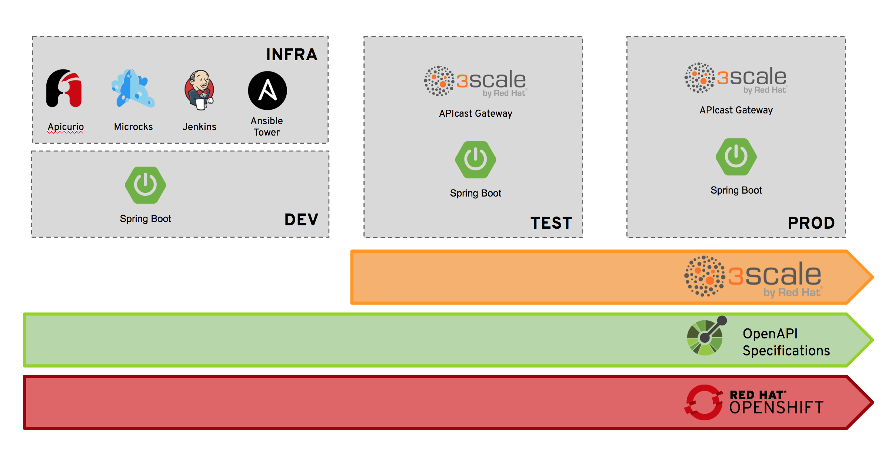

# ACME Beer Catalog Workshop

This repository contains materials and instructions on how to run a Workshop around the `beer-catalog-demo` introduced on Red Hat Developers Blog into a 3 part blog series called [An API Journey: from Mock to Deployment the Agile way](https://developers.redhat.com/blog/2018/04/11/api-journey-idea-deployment-agile-part1/).

While blog series was focusing of giving a broad view of the API Full Lifecycle, we have found many customers asking for detailed workshop on that topic. Especially regarding the continuous delivery of API Configuration within the 3scale API Management backend.

## Overview

During this workshop, you will go through the different stages composing the API Full Lifecycle and you will learn how to craft an API, mock it to break dependencies, built it using contract-first approach and deploy your API implementation and policy configuration in a continuous way. You'll also see how to use 3scale API Management capabilities to monitor and monitize your API.

The workshop setup is as shown in schema below. We'll use:
  * One or many `INFRA` environment to host the components used during building and deploying. Namely Apicurio, Microcks, Jenkins and Ansible Tower. See the section on *Workshop variants* for discussion on precise setup,
  * One `DEV` environment where attendees will deploy their API implementation (based on Spring Boot but this is also subject to variants),
  * One `TEST` environment where API implementation will be deployed once tested alongside with an API Gateway. In `TEST` environment, we primarily focus on testing/validating the API Gateway policies and configuration as well as feeding API Management system with API declaration,
  * One `PROD` environment where API implementation and API Gateway configuration are promoted after having tested. On the API Management backend side, API definition should also appear as deployed onto a Production environment.

The workshop also implies showing how:
  * Container platforms like OpenShift/Kubernetes allows easy promotion of container based development and API Gareways from environment to environment,
  * OpenAPI Specification can be used as a central asset and a unique *source of truth* for each and every deployment,
  * 3scale API Management backend can be continuously updated and enriched with new API or new API version deployment.

## Materials

You'll find in this repository:
* [Setup instructions](./SETUP.md) with pre-requisites and infrastructure,
* [Running instructions](./RUNNING.md) with instructions on how to run, what actions/commands execute depending on the deployment variant chosen for this workshop.
