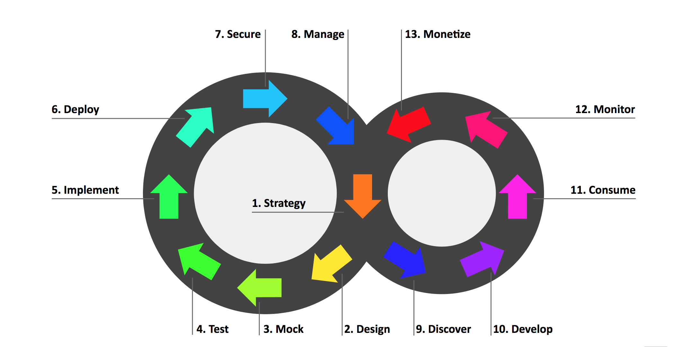

# Running ACME Beer Catalog Workshop

Throughout this workshop, we are discussing the API Full Lifecycle as shown below.



We are going to delve and detail each and every stage on the ACME Beer Catalog use-case that is introduces and exposed into [An API Journey: from Mock to Deployment the Agile way](https://developers.redhat.com/blog/2018/04/11/api-journey-idea-deployment-agile-part1/) blog series.

In this document, we'll only cover the stages that require technical materials such as contracts, scripts, templates and so on...

## Stage 2: Design

This stage is an opportunity to have discussion around: contract-first approach, semantic versioning best practices, data modeling, collaboration around APIcurio and Git, Swagger and OpenAPI specifications, ...

The API Definition you may want to import in APIcurio : https://raw.githubusercontent.com/microcks/api-lifecycle/master/beer-catalog-demo/api-contracts/beer-catalog-api-swagger.json

> If you plan to use the same Microcks instance for attendees and let them recreate the mocks, ensure to make them create different variants of this API by changing the name or the version. Also, make them pus their work to different Git repositories.

## Stage 3: Mock

This stage requires having Postman installed somewhere on attendees laptop.

It is the appropriate time to discuss: utility of mocking, ways to provide representative samples for an API, the documentation information it represents, how to make the dataset evolve and be enriched throughout the whole life of API, the matching of dataset with API versioning, ...

Many ways of doing things:
* Load this reference Postman Collection in Postman : https://raw.githubusercontent.com/microcks/api-lifecycle/master/beer-catalog-demo/api-contracts/Beer%20Catalog%20API.postman_collection.json and just explore it than create a Job within Microcks with the same URL.
* Let attendees clone the reference and import it in their Postman instance, change API name and version if you plan to use the same Microcks instance,
* Import the API contract designed on **Stage 2** and make attendees create their samples step by step.

> If you choose one of the two latest options, be really careful about the respect of conventions regarding version property in Postman to allow smooth import into Microcks.

At the end of this stage, you should have running mocks into Microcks. You may want attendees to test a bunch of CURL commands to illustrate that mocks are up and running. Using the reference Postman Collection, here are a bunch of commands (they assume running on a local CDK instance and should be adapted to your environment)

```sh
curl -X GET 'http://microcks-microcks.192.168.99.100.nip.io/rest/Beer%20Catalog%20API/0.9/beer/Weissbier'

curl -X GET 'http://microcks-microcks.192.168.99.100.nip.io/rest/Beer%20Catalog%20API/0.9/beer?page=0'

curl -X GET 'http://microcks-microcks.192.168.99.100.nip.io/rest/Beer%20Catalog%20API/0.9/beer?page=1'

curl -X GET 'http://microcks-microcks.192.168.99.100.nip.io/rest/Beer%20Catalog%20API/0.9/beer/findByStatus/available'
```

## Stage 4: TEST

During the exploration of this stage, you may want to discuss: different types of tests (from Logical Unit Test to System-wide Functional Tests/User Acceptance Test), have a focus on Integration Tests and Contracts Tests, how business expectations are different to semantic validations, what is the best appropriate time to execute each kind of tests, ...

In this stage you may just explore the [reference Postman Collection](https://raw.githubusercontent.com/microcks/api-lifecycle/master/beer-catalog-demo/api-contracts/Beer%20Catalog%20API.postman_collection.json) or add test to the attendee variants you have created earlier in **Stage 3**.

You may want to explore the test feature of Microcks by running a manual tests against the mock endpoint itself ;-)

## Stage 5: IMPLEMENT

In this stage we will deploy a first implementation of our API. A reference implementation using Spring Boot is provided here https://github.com/microcks/api-lifecycle/tree/master/beer-catalog-demo/api-implementation.

If you have not pre-populated all the OpenShift/Kubernetes environments, it's time making your attendees create a new environment. They may just login on OpenShift console and create a `${user}-beer-catalog-dev` environment with display name `Beer Catalog (DEV) - ${user}`.

Then deploy the API implementation using `Red Hat OpenJDK 8` template with this parameters :
* App Name : `beer-catalog-impl`
* Source Repo : `https://github.com/microcks/api-lifecycle.git`
* Source Context Dir : `/beer-catalog-demo/api-implementation`

Wait for some minutes for deployment. Then you can just grab the created OpenShift route for application, realize a test through Microcks *NEW TEST* feature. If using the reference implementation above, you'll have to append an `/api` suffix to the route in order to reach out implementation endpoint for API.

> To put even more emphasis onto the contract-first approach, it is possible to illustrate the generation of a skeleton application using contract. APIcurio as new nice feature that allows to generate a [Thorntail](https://thorntail.io/) app from the GUI. We have also run this workshop using the contract-first approach to generate a Fuse/Apache Camel application based on contracts.

## Stage 6: DEPLOY

It is now time to create and/or explore the other TEST and PROD environments. This is the appropriate time for discussing: environment provisionning process, how much time it takes, the part of it that is automated or not, ...

If you do not have already created everything in advance for your attendees, you may want to let them do everything. There are many ways of running this and we prepared a few materials for this:

* There's a `deploy-envs.sh` [shell script](./deploy-envs.sh) provided in this repository that may create everything for you, both the TEST and PROD environments as well as all the `DeploymentConfig` for this environment. User should be logged into OpenShift before executing it. Depending on your Infrastructure setup, you may want to run this shell with 1 or 2 arguments:
  * 1st argument is the `USER` within OpenShift plateform, so that everything project will be prefixed with `${user}` as we exposed in the [Overview, variants section](./README.md),
  * 2nd argument if the name of the project the Microcks instance is deployed. This can be a generic transversal instance or one that is specific to your user.

* There's an `env-template.yaml` [OpenShift template](./env-template.yaml) provided in this repository that you may want to load into the common `openshift` namespace and then the attendee may use 2 times to initialize both the TEST and PROD environment
  * Remember that before being able to actually deploy stuffs, the service accounts of this projects should be allowed to pull images from DEV one. So you'll have to execute following commands to allow this:
  ```sh
  oc adm policy add-role-to-group system:image-puller system:serviceaccounts:${TEST_ENV} -n ${DEV_ENV}
  oc adm policy add-role-to-group system:image-puller system:serviceaccounts:${PROD_ENV} -n ${DEV_ENV}
  ```


## Stage 7: SECURE
