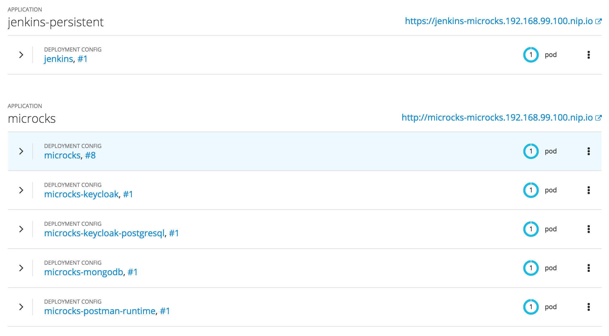
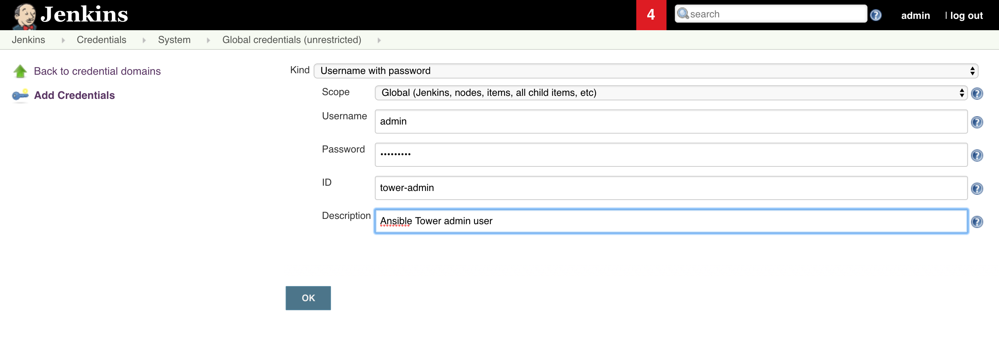

# ACME Beer Catalog Workshop Setup

## Prerequisites

* Each attendee / group of attendees should have a laptop running Lunix / Mac OS X or having access to a Linux terminal
* Internet access with no blacklist filtering on `*.apicurio.io`, `*.github.com`, `*.githubusercontent.com`, `*.getpostman.com`
* Ability to install Postman client tool on laptop
* Ability to install OpenShift client tool (`oc`) on laptop or remote machine
* Ability to install system utilities (`curl`, `git`, `sed`, `ansible`) on laptop or remote machine
* An OpenShift cluster with enough resources for instantiating ~15 pods using 3 GB RAM per attendee / group of attendees

## Utilities setup

### On Linux
Depending on your distribution, you should be able to install `ansible` through your package manager.

On Ubuntu / Debian : `sudo apt-get install ansible`
On Fedora : `sudo dnf install ansible`
On RHEL/CentOS :
```sh
$ yum install epel-release -y
$ yum install ansible -y
```

On other distros you may just use :
```sh
$ pip install ansible
```

### On Mac OS X

The easiest path is to install missing parts using Homebrew. If Homebrew not present on your laptop, just run the following command :
```sh
$ usr/bin/ruby -e "$(curl -fsSL https://raw.githubusercontent.com/Homebrew/install/master/install)"
```

Then, when Homebrew is setup, just run this command to install `ansible` (everything else should just be already there) :
```sh
$ brew install ansible
```

### On both

Install Postman by getting the appropriate released binary here: https://www.getpostman.com/apps

### Pre-Lab Infrastructure Setup

## Prepare your 3scale instance

Create an Access Token in your 3scale SaaS Tenant that has read-write access to the Account Management API. Please check [3scale documentation](https://access.redhat.com/documentation/en-us/red_hat_3scale/2-saas/html-single/accounts/index#access_tokens) on how to get an access token. Write down this value for later use.

You will also need the name of your 3scale tenant.

On your 3scale Admin Portal, go the `Developer Portal` section and replace your standard `Documentation` page by [the content of documentation.html](documentation.html).

## Ansible Tower setup

In a transversal project that may be accessible to each attendee / group of attendees, instantiate an Ansible Tower. This setup should be done before the lab. It will require ansible command line (`brew install ansible` or `yum install ansible`)

### 1/ Prepare a Persistent Volume Claim

Once logged in your target projet:

```sh
$ oc apply -f - <<EOF
apiVersion: "v1"
kind: "PersistentVolumeClaim"
metadata:
  name: "postgresql"
spec:
  accessModes:
    - "ReadWriteOnce"
  resources:
    requests:
      storage: "5Gi"
EOF
```

### 2/ Clone the Git repositories

Retrieve community AWX and associated logos

```sh
$ git clone https://github.com/ansible/awx.git
$ git clone https://github.com/ansible/awx-logos.git
```

### 3/ Run the install playbook

Make sure you are logged in your OpenShift cluster and on the target project with:

```sh
oc whoami
oc project
```

Then, run the AWX installer with :

```sh
$ cd awx
$ git checkout 2b9954c . # TODO replace me by a tag as soon as AWX 1.0.8 is released
$ cd installer
$ ansible-playbook -i inventory install.yml -e kubernetes_web_version=1.0.7.2 \
   -e kubernetes_web_version=1.0.7.2 -e kubernetes_memcached_image=1.5.10 \
   -e openshift_host="$(oc whoami --show-server)" -e openshift_skip_tls_verify=true \
   -e openshift_project="$(oc project -q)" -e openshift_user="$(oc whoami)" \
   -e openshift_token="$(oc whoami -t)" -e admin_user=admin \
   -e admin_password=redhat123 -e awx_official=true
```

The default installation of AWX uses a combination of `latest` tags and an `imagePullPolicy` set to `always`, which is a recipe for disaster. All tags have been set explicitely on the command line earlier, now you can set the `imagePullPolicy` to `IfNotPresent`.

```sh
oc patch dc/awx --type=json -p '[ { "op": "replace", "path": "/spec/template/spec/containers/0/imagePullPolicy", "value": "IfNotPresent" }, { "op": "replace", "path": "/spec/template/spec/containers/1/imagePullPolicy", "value": "IfNotPresent" }, { "op": "replace", "path": "/spec/template/spec/containers/2/imagePullPolicy", "value": "IfNotPresent" }, { "op": "replace", "path": "/spec/template/spec/containers/3/imagePullPolicy", "value": "IfNotPresent" } ]'
```

> Note: Ansible Tower containers requested resources may be considered a little high for a simple workshop. You may to lower them if you're resources constraint, in particular if using CDK. You may edit DeployConfig and lower them.

Wait for deployment to be finished.

### 4/ Configure project and job in AWX

Login on AWX with user you just created, go to the *Projects* section and add a new project with following properties :
* Name: `Deploy API to 3scale`
* Description: `Enable continuous deployment of an API to 3scale AMP`
* Organization: `default`
* SCM Type: `Git`
* SCM URL: `https://github.com/nmasse-itix/threescale-cicd-awx`
* SCM Branch/Tag/Commit: `1.0.5` (or any newly available tag on [github.com/nmasse-itix/threescale-cicd-awx](https://github.com/nmasse-itix/threescale-cicd-awx/releases). Otherwise, pick the `master` if you are feeling lucky.)

You can also tick `Update Revision on Launch` and setup a cache timeout.

Then you have to add a new *Job Template* with following properties :
* Name: `Deploy an API to 3scale`
* Project: `Deploy API to 3scale`
* Playbook: `deploy-api.yml`
* Inventory: `Prompt on Launch`
* Extra-variables: `Prompt on Launch`

### 5/ Declare inventories

For each of your environments (DEV, TEST, PROD, etc.), you will have to declare an inventory into AWX.

The inventories to declare are made of several components:

* Global Variables
* A group named `threescale`
* Group Variables
* A host matching your 3scale admin portal

Those objects are nested as such:

```raw
inventory
  |
  +-> Global Variables
  +-> threescale group
        |
        +-> Group variables
        +-> Host lbroudou-redhat-admin.3scale.net
```

For each inventory, you will have to :

* Go to `Inventories` > `+` > `Inventory`
* Give it a meaningful name (such as `3scale-test` or `3scale-prod`)
* Set the global variables to:

```yaml
---
ansible_connection: local
```

* Click `Save`
* Move to the `Groups` section
* Click `+`
* Fill-in the `Name` field with `threescale`
* In the group variables, you will have to add your access token to 3scale API Management backend, the name of environment as well as the wildcard that will be used to serve Gateway through Route. For instance :

```YAML
---
threescale_cicd_access_token: <3scale_access_token>
threescale_cicd_api_environment_name: test
threescale_cicd_wildcard_domain: prod.192.168.99.100.nip.io
```

* Then, declare one host in this group that is the 3scale API Management server we’ll use for deploying our API. For example: `lbroudou-redhat-admin.3scale.net`

We propose creating just 2 inventories right now in order to test everything out :

* `3scale-test` will be used as the base inventory when launching the Tower job to deploy API to TEST environment,
* `3scale-prod` will be used as the base inventory when launching the Tower job to deploy API to PROD environment.

> Hint: you can copy/paste your first inventory to create the subsequent ones. Then, you just need to change its name and the group variables.

## Microcks setup

This section may be run for each attendee / group of attendees if you have decided going that way.

### 1/ Create a new project holding Microcks stuffs for user

```sh
$ oc new-project microcks --display-name="Microcks"
```

### 2/ Register Microcks template within project

```sh
$ oc create -f https://raw.githubusercontent.com/microcks/microcks/master/install/openshift/openshift-persistent-full-template.yml -n microcks
```

### 3/ Instantiate template, deploying Microcks

The command below should be run by a cluster administrator because it requires to create an OAuthClient in OpenShift. In the command below, replace the variables by your values:
* `<project>` : name of project where setup is done. Here microcks.
* `<master_url>` : the HTTPS URL of OpenShift master
* `<app_host_url>` : the Host for Routes, ex `192.168.99.100.nip.io` when using CDK or Minishift.

```sh
$ oc new-app --template=microcks-persistent --param=APP_ROUTE_HOSTNAME=microcks-<project>.<app_host_url> --param=KEYCLOAK_ROUTE_HOSTNAME=keycloak-<project>.<app_host_url> --param=OPENSHIFT_MASTER=<master_url> --param=OPENSHIFT_OAUTH_CLIENT_NAME=<project>-client
```

### 4/ Create a Jenkins Master image containing Microcks plugin

```sh
$ oc process -f https://raw.githubusercontent.com/microcks/microcks-jenkins-plugin/master/openshift-jenkins-master-bc.yml | oc create -f -
```

Wait for build to finish.

### 5/ Deploy a Jenkins instance with this custom Master image

```sh
$ oc new-app --template=jenkins-persistent --param=NAMESPACE=microcks --param=JENKINS_IMAGE_STREAM_TAG=microcks-jenkins-master:latest
```

Wait for deployment to finish before getting on next step. When going to *Overview* of your OpenShift project, you should get the following pods running:




## Jenkins setup for Ansible Tower

Once Jenkins instance has been setup in previous step, you finally need to configure the connection between Jenkins and AWX/Ansible Tower. To do this, go to Jenkins, click on *Manage Jenkins* > *Manage Plugins* and install the `Ansible Tower` plugin. You do not need to restart Jenkins.

Then click on *Credentials* > *System*, click on *Global credentials (unrestricted)* and select *Add Credentials...* to add a new user for connection to AWX/Ansible Tower. Fill-in your AWX/Tower Admin login and password, and choose `tower-admin` for the id field.



Finally, you also have to configure an alias to your AWX Server into Jenkins. This will allow our Jenkins pipelines to access the AWX server easily without knowing the complete server name or address. Click on *Configure System* in the management section and then go to the *Ansible Tower* section and add a new Tower Installation. Give it a name (we've simply used `tower` in our scripts), fill the URL and specify that it should be accessed using the user and credentials we have just created before.


## OpenShift for running Workshop

Create a bunch of users (from `user01` to `user10` for example) so that they will be autohrized to authenticate and create projects if you plan to let them do that. See [Variants in overview](./README.md)).
