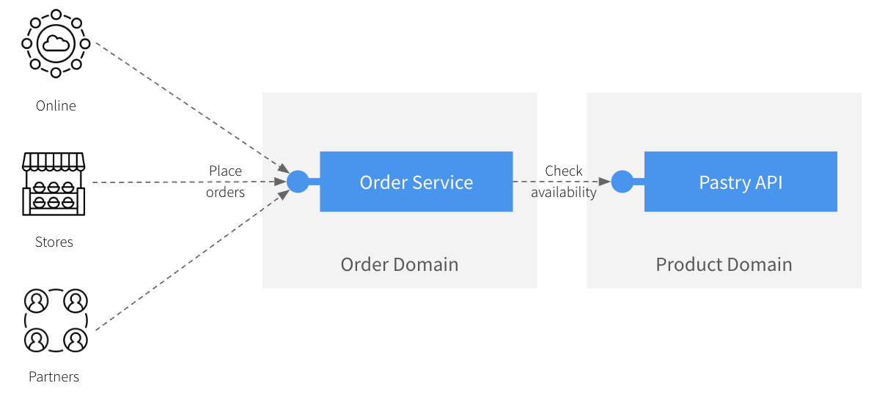
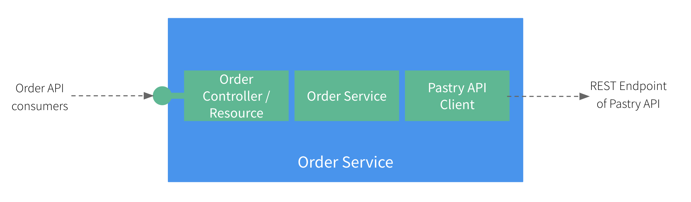

# Shift-left demo - NestJS Order Service

This application is a sample on how to integrate Microcks via Testcontainers within your development inner-loop.

[NestJS](https://nestjs.com/) is a progressive <a href="http://nodejs.org" target="_blank">Node.js</a> framework for building efficient and scalable server-side applications.

<p align="center">
  <a href="http://nestjs.com/" target="blank"></a>
</p>

## Application introduction

This fictional application we're working on is a typical `Order Service` that can allow online, physical stores, or even 
partners to place orders for our fresh-backed pastries! For that, the `Order Service` is exposing a REST API to its consumers
but also relies on an existing API we have [introduced in a previous post](https://medium.com/@lbroudoux/different-levels-of-api-contract-testing-with-microcks-ccc0847f8c97) 😉



The `Order Service` application has been designed around 3 main components that are directly mapped on Spring Boot components and classes:
* The `OrderController` (in package `src/order/order.controller.ts`) is responsible for exposing an `Order API` to the outer world. This API is specified using the `test/resources/order-service-openapi.yaml` OpenAPI specification,
* The `OrderService` (in package `src/order/order.service.ts`) is responsible for implementing the business logic around the creation of orders. Typically, it checks that the products are available before recording an order. Otherwise, order cannot be placed,
* The `PastryAPIClient` (in package `src/pastry/pastry.service.ts`) is responsible for calling the `Pastry API` in *Product Domain* and get details or list of pastries.  



Of course, this is a very naive vision of a real-life system as such an application would certainly pull out much more
dependencies (like a `Payment Service`, a `Customer Service`, a `Shipping Service`, and much more) and offer more complex API.
However, this situation is complex enough to highlight the two problems we're addressing:
1) How to **efficiently set up a development environment** that depends on third-party API like the Pastry API? 
You certainly want to avoid cloning this component repository, figuring out how to launch it and configure it accordingly. As a developer, developing your own mock of this service makes you also lose time and risk drifting from initial intent,
2) How to **efficiently validate the conformance** of the `Order API` against business expectations and OpenAPI contract? 
Besides the core business logic, you might want to validate the network and protocol serialization layers as well as the respect of HTTP semantics.

## Installation

Once this repository cloned on your local machine, you have to start with fetching the required dependencies:

```shell
$ npm install
```

## Development phase

Let's imagine you start an interactive development/testing session, running your local server with:

```shell
$ npm run start
==== OUTPUT ====
> nest-order-service@0.0.1 start
> nest start

[Nest] 82448  - 21/11/2023 09:50:19     LOG [NestFactory] Starting Nest application...
[Nest] 82448  - 21/11/2023 09:50:19     LOG [InstanceLoader] ConfigHostModule dependencies initialized +7ms
[Nest] 82448  - 21/11/2023 09:50:19     LOG [InstanceLoader] AppModule dependencies initialized +0ms
[Nest] 82448  - 21/11/2023 09:50:19     LOG [InstanceLoader] ConfigModule dependencies initialized +0ms
[Nest] 82448  - 21/11/2023 09:50:19     LOG [InstanceLoader] PastryModule dependencies initialized +0ms
[Nest] 82448  - 21/11/2023 09:50:19     LOG [InstanceLoader] OrderModule dependencies initialized +0ms
[Nest] 82448  - 21/11/2023 09:50:19     LOG [RoutesResolver] AppController {/}: +6ms
[Nest] 82448  - 21/11/2023 09:50:19     LOG [RouterExplorer] Mapped {/, GET} route +1ms
[Nest] 82448  - 21/11/2023 09:50:19     LOG [RoutesResolver] OrderController {/orders}: +0ms
[Nest] 82448  - 21/11/2023 09:50:19     LOG [RouterExplorer] Mapped {/orders, POST} route +1ms
[Nest] 82448  - 21/11/2023 09:50:19     LOG [NestApplication] Nest application successfully started +1ms
```

You can start Microcks as a utility tool with this simple command `microcks.sh`. Microcks docker-compose file (`microcks-docker-compose.yml`)
has been configured to automatically import the `Order API` contract but also the `Pastry API` contracts. Both APIs are discovered on startup
and Microcks UI should be available on `http://localhost:9090` in your browser:

```shell
$ ./microcks.sh
==== OUTPUT ====
[+] Running 3/2
 ✔ Network nest-boot-order-service_default       Created                                                                                                                                       0.0s 
 ✔ Container nest-order-service-microcks-1  Created                                                                                                                                      0.0s 
 ✔ Container nest-order-service-importer-1  Created                                                                                                                                      0.0s 
Attaching to nest-order-service-importer-1, nest-order-service-microcks-1
nest-order-service-microcks-1  | exec java -XX:+UseParallelGC -XX:GCTimeRatio=4 -XX:AdaptiveSizePolicyWeight=90 -XX:MinHeapFreeRatio=20 -XX:MaxHeapFreeRatio=40 -XX:+ExitOnOutOfMemoryError -cp . -jar /deployments/app.jar
nest-order-service-importer-1  | Got error when invoking Microcks client retrieving config: Get "http://microcks:8080/api/keycloak/config": dial tcp 172.29.0.2:8080: connect: connection refused
nest-order-service-importer-1 exited with code 1
nest-order-service-importer-1  | Got error when invoking Microcks client retrieving config: Get "http://microcks:8080/api/keycloak/config": dial tcp 172.29.0.2:8080: connect: connection refused
nest-order-service-importer-1 exited with code 1
nest-order-service-microcks-1  | 
nest-order-service-microcks-1  |   .   ____          _            __ _ _
nest-order-service-microcks-1  |  /\\ / ___'_ __ _ _(_)_ __  __ _ \ \ \ \
nest-order-service-microcks-1  | ( ( )\___ | '_ | '_| | '_ \/ _` | \ \ \ \
nest-order-service-microcks-1  |  \\/  ___)| |_)| | | | | || (_| |  ) ) ) )
nest-order-service-microcks-1  |   '  |____| .__|_| |_|_| |_\__, | / / / /
nest-order-service-microcks-1  |  =========|_|==============|___/=/_/_/_/
nest-order-service-microcks-1  | 
nest-order-service-microcks-1  |  :: Spring Boot ::                (v3.1.1)
nest-order-service-microcks-1  | 
nest-order-service-microcks-1  | 
nest-order-service-microcks-1  | 08:56:15.437  INFO 1 --- [      main] i.g.microcks.MicrocksApplication         : Starting MicrocksApplication using Java 17.0.9 with PID 1 (/deployments/app.jar started by ? in /deployments)
nest-order-service-microcks-1  | 08:56:15.439 DEBUG 1 --- [      main] i.g.microcks.MicrocksApplication         : Running with Spring Boot v3.1.1, Spring v6.0.10
nest-order-service-microcks-1  | 08:56:15.439  INFO 1 --- [      main] i.g.microcks.MicrocksApplication         : The following 1 profile is active: "uber"
nest-order-service-importer-1  | Got error when invoking Microcks client retrieving config: Get "http://microcks:8080/api/keycloak/config": dial tcp 172.29.0.2:8080: connect: connection refused
nest-order-service-importer-1 exited with code 1
nest-order-service-importer-1  | Got error when invoking Microcks client retrieving config: Get "http://microcks:8080/api/keycloak/config": dial tcp 172.29.0.2:8080: connect: connection refused
nest-order-service-importer-1 exited with code 1
nest-order-service-microcks-1  | 08:56:16.718  INFO 1 --- [      main] i.g.microcks.config.WebConfiguration     : Starting web application configuration, using profiles: [uber]
nest-order-service-microcks-1  | 08:56:16.719  INFO 1 --- [      main] i.g.microcks.config.WebConfiguration     : Web application fully configured
nest-order-service-microcks-1  | 08:56:16.758  INFO 1 --- [      main] i.g.m.c.EmbeddedMongoConfiguration       : Creating a new embedded Mongo Java Server with in-memory persistence
nest-order-service-microcks-1  | 08:56:16.874  INFO 1 --- [      main] de.bwaldvogel.mongo.MongoServer          : started MongoServer(port: 35781, ssl: false)
nest-order-service-microcks-1  | 08:56:16.940  INFO 1 --- [      main] org.mongodb.driver.client                : MongoClient with metadata {"driver": {"name": "mongo-java-driver|sync", "version": "4.9.1"}, "os": {"type": "Linux", "name": "Linux", "architecture": "aarch64", "version": "5.15.49-linuxkit-pr"}, "platform": "Java/Red Hat, Inc./17.0.9+9-LTS"} created with settings MongoClientSettings{readPreference=primary, writeConcern=WriteConcern{w=null, wTimeout=null ms, journal=null}, retryWrites=true, retryReads=true, readConcern=ReadConcern{level=null}, credential=null, streamFactoryFactory=null, commandListeners=[], codecRegistry=ProvidersCodecRegistry{codecProviders=[ValueCodecProvider{}, BsonValueCodecProvider{}, DBRefCodecProvider{}, DBObjectCodecProvider{}, DocumentCodecProvider{}, CollectionCodecProvider{}, IterableCodecProvider{}, MapCodecProvider{}, GeoJsonCodecProvider{}, GridFSFileCodecProvider{}, Jsr310CodecProvider{}, JsonObjectCodecProvider{}, BsonCodecProvider{}, EnumCodecProvider{}, com.mongodb.client.model.mql.ExpressionCodecProvider@4afd21c6, com.mongodb.Jep395RecordCodecProvider@4d0753c9]}, loggerSettings=LoggerSettings{maxDocumentLength=1000}, clusterSettings={hosts=[localhost:35781], srvServiceName=mongodb, mode=SINGLE, requiredClusterType=UNKNOWN, requiredReplicaSetName='null', serverSelector='null', clusterListeners='[]', serverSelectionTimeout='30000 ms', localThreshold='30000 ms'}, socketSettings=SocketSettings{connectTimeoutMS=10000, readTimeoutMS=0, receiveBufferSize=0, sendBufferSize=0}, heartbeatSocketSettings=SocketSettings{connectTimeoutMS=10000, readTimeoutMS=10000, receiveBufferSize=0, sendBufferSize=0}, connectionPoolSettings=ConnectionPoolSettings{maxSize=100, minSize=0, maxWaitTimeMS=120000, maxConnectionLifeTimeMS=0, maxConnectionIdleTimeMS=0, maintenanceInitialDelayMS=0, maintenanceFrequencyMS=60000, connectionPoolListeners=[], maxConnecting=2}, serverSettings=ServerSettings{heartbeatFrequencyMS=10000, minHeartbeatFrequencyMS=500, serverListeners='[]', serverMonitorListeners='[]'}, sslSettings=SslSettings{enabled=false, invalidHostNameAllowed=false, context=null}, applicationName='null', compressorList=[], uuidRepresentation=UNSPECIFIED, serverApi=null, autoEncryptionSettings=null, contextProvider=null}
nest-order-service-microcks-1  | 08:56:16.948  INFO 1 --- [er-worker1] d.b.m.wire.MongoWireProtocolHandler      : client [id: 0xff8d5ff5, L:/127.0.0.1:35781 - R:/127.0.0.1:56706] connected
nest-order-service-microcks-1  | 08:56:16.948  INFO 1 --- [er-worker2] d.b.m.wire.MongoWireProtocolHandler      : client [id: 0x4c3662c5, L:/127.0.0.1:35781 - R:/127.0.0.1:56704] connected
nest-order-service-microcks-1  | 08:56:16.998  INFO 1 --- [host:35781] org.mongodb.driver.cluster               : Monitor thread successfully connected to server with description ServerDescription{address=localhost:35781, type=STANDALONE, state=CONNECTED, ok=true, minWireVersion=0, maxWireVersion=6, maxDocumentSize=16777216, logicalSessionTimeoutMinutes=null, roundTripTimeNanos=58685042}
nest-order-service-microcks-1  | 08:56:17.226  INFO 1 --- [      main] i.g.m.config.AICopilotConfiguration      : AICopilot is disabled
nest-order-service-importer-1  | Got error when invoking Microcks client retrieving config: Get "http://microcks:8080/api/keycloak/config": dial tcp 172.29.0.2:8080: connect: connection refused
nest-order-service-importer-1 exited with code 1
nest-order-service-microcks-1  | 08:56:17.514  INFO 1 --- [      main] i.g.m.util.grpc.GrpcServerStarter        : GRPC Server started on port 9090
nest-order-service-microcks-1  | 08:56:17.581  INFO 1 --- [      main] i.g.m.config.SecurityConfiguration       : Starting security configuration
nest-order-service-microcks-1  | 08:56:17.582  INFO 1 --- [      main] i.g.m.config.SecurityConfiguration       : Keycloak is disabled, permitting all requests
nest-order-service-microcks-1  | 08:56:17.931  INFO 1 --- [      main] i.g.microcks.MicrocksApplication         : Started MicrocksApplication in 2.682 seconds (process running for 3.201)
[...]
nest-order-service-importer-1  | Microcks has discovered 'Order Service API:0.1.0'
[...]
nest-order-service-importer-1  | Microcks has discovered 'API Pastries:0.0.1'
[...]
nest-order-service-importer-1  | Microcks has discovered 'API Pastries:0.0.1'
[...]
nest-order-service-importer-1 exited with code 0
```

Because our `Order Service` application has been configured to talk to Microcks mocks (see the default settings in `src/pastry/pastry.module.ts`),
you should be able to directly call the Order API and invoke the whole chain made of the 3 components:

```shell
$ curl -XPOST localhost:3000/orders -H 'Content-type: application/json' \
    -d '{"customerId": "lbroudoux", "productQuantities": [{"productName": "Millefeuille", "quantity": 1}], "totalPrice": 10.1}'
==== OUTPUT ====
{"id":"dade7d85694","status":"CREATED","customerId":"lbroudoux","productQuantities":[{"productName":"Millefeuille","quantity":1}],"totalPrice":10.1}
```

## Unit Test phase

In addition, Microcks can also be launched automatically within your unit tests using [Testcontainers](https://testcontainers.com/).
Microcks provides a [`microcks-testcontainers-node`](https://github.com/microcks/microcks-testcontainers-node) module you can integrate in Jest tests.
Check the `package.json` of this project to see how to declare dependencies.

### Mock your dependencies

In the case you're using Jest, the plumbing happens in the `beforeAll()` function where you start Microcks and import the artifacts you'll need in your tests to mock the `Pastry API` dependency:

```typescript
beforeAll(async () => {
  // Start container and load artifacts.
  container = await new MicrocksContainer()
    .withMainArtifacts([path.resolve(resourcesDir, 'apipastries-openapi.yml')])
    .withSecondaryArtifacts([path.resolve(resourcesDir, 'apipastries-postman-collection.json')])
    .start();

  // Custom NestJS module init.
  [...]
});
```

Once the Microcks container is started, we then need to update the `pastries.baseurl` application property that is used by the `PastryService` component to know the endpoint of this external API. Here, we have to replace the one defined in the default module sources by a new URL directly provided by the Microcks container:

```typescript
const module: TestingModule = await Test.createTestingModule({
  imports: [ConfigModule.forRoot({
    load: [() => ({
      'pastries.baseurl': container.getRestMockEndpoint('API Pastries', '0.0.1')
    })],
  })],
  providers: [PastryService],
}).compile();
```

Finally, we can define our unit test method that allow checking that the `PastryService` (here via the `service` reference) is working as expected:

```typescript
it('should retrieve pastries by size', async () => {
  let pastries: Pastry[] = await service.getPastries('S');
  expect(pastries.length).toBe(1);
});
```

Do not forget then to stop and tear down resources at the end of the tests:

```typescript
afterAll(async () => {
  // Now stop the container.
  await container.stop();
});
```

### OpenAPI contract testing

Remember the 2 problems we're trying to solve here? The 2nd one is about how to validate the conformance of the `Order API` we'll
expose to consumers. We certainly can write an integration test that uses [Supertest](https://github.com/ladjs/supertest) or other libraries
to invoke the exposed Http layer and validate each and every response with assertions like:

```typescript
describe('GET /users', function() {
  it('responds with json', async function() {
    const response = await request(app)
      .get('/users')
      .set('Accept', 'application/json')
    expect(response.headers["Content-Type"]).toMatch(/json/);
    expect(response.status).toEqual(200);
    expect(response.body.email).toEqual('foo@bar.com');
  });
});
```

This certainly works but presents 2 problems in my humble opinion:
* It's a lot of code to write! And it's apply to each API interaction because for each interaction it's probably a good idea to
check the structure of same objects in the message. This lead to a fair amount of code!
* The code you write here is actually a language specific translation of the OpenAPI specification for the `Order API`: so the same
"rules" get duplicated. Whether you edit the code or the OpenAPI spec first, high are the chances you get some drifts between your test 
suite and the specification you will provide to consumers!

Microcks Testcontainer integration provides another approach by letting you reuse the OpenAPI specification directly in your test suite,
without having to write assertions and validation of messages for API interaction.

In the case you're using Jest, the plumbing happens in the `beforeAll()` function where you start Microcks and import the artifacts you'll need in your tests to mock the `Pastry API` dependency but also the `Order Service` OpenAPI specification so that Microcks know your test suite "rules". The little difference here is that this container must have access to the host you're running your unit/integration test on: 

```typescript
beforeAll(async () => {
  // Find a free port in a range and expose this port to testcontainers.
  appPort = (await findFreePorts(1, {startPort: 3000, endPort: 3100}))[0];
  await TestContainers.exposeHostPorts(appPort);

  // Start container and load artifacts.
  container = await new MicrocksContainer()
    .withMainArtifacts([
      path.resolve(resourcesDir, 'order-service-openapi.yml'),
      path.resolve(resourcesDir, 'apipastries-openapi.yml')
    ])
    .withSecondaryArtifacts([path.resolve(resourcesDir, 'apipastries-postman-collection.json')])
    .start();

  // Start our application configuring it to resolve Microcks mocks for pastries.
  const moduleFixture: TestingModule = await Test.createTestingModule({
    imports: [
      ConfigModule.forRoot({
        load: [() => ({
          'pastries.baseurl': container.getRestMockEndpoint('API Pastries', '0.0.1')
        })],
      }), AppModule],
  }).compile();

  app = moduleFixture.createNestApplication();
  await app.listen(appPort);
});
```

> You may check the `test/orders.api.e2e-spec.ts` file for full source code.

Then, we can define our unit test method that allow checking that the `OrderController` (here via the `testEndpoint` value)
is conformant with the OpenAPI specification for `Order Service`, version `0.1.0`. The nice thing is that it's just one call for validating
all the interactions with the API. That method is also super easy to enrich in the future: when the next `0.2.0` version of the API will
be under-development, you'll be able to check the conformance with both `0.1.0` and `0.2.0` as per the semantic versioning requirements.

```typescript
it('should conform to OpenAPI spec', async () => {
  var testRequest: TestRequest = {
    serviceId: "Order Service API:0.1.0",
    runnerType: TestRunnerType.OPEN_API_SCHEMA,
    testEndpoint: "http://host.testcontainers.internal:" + appPort,
    timeout: 3000
  };

  var testResult = await container.testEndpoint(testRequest);

  console.log(JSON.stringify(testResult));

  expect(testResult.success).toBe(true);
  expect(testResult.testCaseResults.length).toBe(1);
  expect(testResult.testCaseResults[0].testStepResults.length).toBe(2);
});
```

> Note we're using the special `host.testcontainers.internal` hostname that is your running host hostname that can be reached out
from the Microcks container. Remember that it's this container that is actually calling the `OrderController` API.

For more information on the `TestResult` class and the available properties, please check the [`microcks-testcontainers-node`](https://github.com/microcks/microcks-testcontainers-node) documentation.

Finally, do not forget then to stop and tear down resources at the end of the tests:

```typescript
afterAll(async () => {
  // Now stop the container and the network.
  await container.stop();
  await app.close();
});
```

You can run this test with following command to expect a result similar to this one below:

```shell
$ npm run test:e2e -- --runTestsByPath test/orders.api.e2e-spec.ts
==== OUTPUT ====
> nest-order-service@0.0.1 test:e2e
> jest --config ./test/jest-e2e.json --runInBand --runTestsByPath test/orders.api.e2e-spec.ts

  console.log
    {"id":"655c81f3de496e494b7485af","version":2,"testNumber":1,"testDate":1700561395445,"testedEndpoint":"http://host.testcontainers.internal:3009","serviceId":"655c81f3de496e494b748596","timeout":3000,"elapsedTime":72,"success":true,"inProgress":false,"runnerType":"OPEN_API_SCHEMA","testCaseResults":[{"success":true,"elapsedTime":72,"operationName":"POST /orders","testStepResults":[{"success":true,"elapsedTime":52,"requestName":"invalid_order","message":""},{"success":true,"elapsedTime":20,"requestName":"valid_order","message":""}]}]}

      at Object.<anonymous> (orders.api.e2e-spec.ts:69:15)

 PASS  test/orders.api.e2e-spec.ts (7.36 s)
  OrderController (e2e)
    ✓ should conform to OpenAPI spec (607 ms)

Test Suites: 1 passed, 1 total
Tests:       1 passed, 1 total
Snapshots:   0 total
Time:        7.409 s, estimated 11 s
Ran all test suites within paths "test/orders.api.e2e-spec.ts".
```

### Postman-based contract testing

Contract-testing may mean a bunch of different things, and you may not have an OpenAPI specification or it may be not enough to validate all your API rules. Luckily, Microcks allows to implement different levels of contract-testing [as introduced in this blog post](https://medium.com/@lbroudoux/different-levels-of-api-contract-testing-with-microcks-ccc0847f8c97).

In our case, we want to perform additional checks on our API: we want to be sure that when it responds "OK, the order was created" (Http status code `201`), the order has actually been created with the same products and quantities that those in the incoming request. In order to do that, we can use a Postman Collection containing scripts with assertions. That's the purpose of the `test/resources/order-service-postman-collection.json` file. We're going to run and validate this Postman Collection in a new test.

During the initialisation of a Jest test in the `beforeAll()` function, we're now going to use a `MicrocksContainersEnsemble` instead of a single `MicrocksContainer`. This will allow us to beenfit from advanced fetaures like the Postman integration. An `ensemble` proposed the same interface as the single `container` and you have to load your artifacts - including the new `order-service-postman-collection.json`:

```typescript
beforeAll(async () => {
  [...]

  // Start ensemble and load artifacts.
  network = await new Network().start();
  ensemble = await new MicrocksContainersEnsemble(network)
    .withMainArtifacts([
      path.resolve(resourcesDir, 'order-service-openapi.yml'),
      path.resolve(resourcesDir, 'apipastries-openapi.yml')
    ])
    .withSecondaryArtifacts([
      path.resolve(resourcesDir, 'order-service-postman-collection.json'),
      path.resolve(resourcesDir, 'apipastries-postman-collection.json')
    ])
    .start();

  [...]
});
```

> You may check the `test/orders.api.postman.e2e-spec.ts` file for full source code.

Then, we can define our unit test method that allow checking that the `OrderController` (here via the `testEndpoint` value)
is conformant with the Postman Collection loaded for `Order Service`, version `0.1.0`. We're doing that by changing the `runnerType` to specify the `POSTMAN` strategy. The nice thing is that it's still just one call for validating all the interactions with the API - but this time, you'll have to call `ensemble.getMicrocksContainer().testEndpoint()` as shown below:

```typescript
it ('should conform to Postman rules', async () => {
  var testRequest: TestRequest = {
    serviceId: "Order Service API:0.1.0",
    runnerType: TestRunnerType.POSTMAN,
    testEndpoint: "http://host.testcontainers.internal:" + appPort,
    timeout: 3000
  };

  var testResult = await ensemble.getMicrocksContainer().testEndpoint(testRequest);

  console.log(JSON.stringify(testResult));

  expect(testResult.success).toBe(true);
  expect(testResult.testCaseResults.length).toBe(1);
  expect(testResult.testCaseResults[0].testStepResults.length).toBe(2);
});
```

Finally, do not forget then to stop and tear down resources at the end of the tests:

```typescript
afterAll(async () => {
  // Now stop the ensemble and the network.
  await ensemble.stop();
  await network.stop();
  await app.close();
});
```

You can run this test with following command to expect a result similar to this one below:

```shell
$ npm run test:e2e -- --runTestsByPath test/orders.api.postman.e2e-spec.ts
==== OUTPUT ====
> nest-order-service@0.0.1 test:e2e
> jest --config ./test/jest-e2e.json --runInBand --runTestsByPath test/orders.api.postman.e2e-spec.ts

  console.log
    {"id":"655c85f4876c364024107d3e","version":2,"testNumber":1,"testDate":1700562420235,"testedEndpoint":"http://host.testcontainers.internal:3009","serviceId":"655c85f3876c364024107d24","timeout":3000,"elapsedTime":65,"success":true,"inProgress":false,"runnerType":"POSTMAN","testCaseResults":[{"success":true,"elapsedTime":65,"operationName":"POST /orders","testStepResults":[{"success":true,"elapsedTime":51,"requestName":"invalid_order"},{"success":true,"elapsedTime":14,"requestName":"valid_order"}]}]}

      at Object.<anonymous> (orders.api.postman.e2e-spec.ts:68:15)

 PASS  test/orders.api.postman.e2e-spec.ts (9.316 s)
  OrderController (e2e)
    ✓ should conform to Postman rules (1965 ms)

Test Suites: 1 passed, 1 total
Tests:       1 passed, 1 total
Snapshots:   0 total
Time:        9.357 s, estimated 11 s
Ran all test suites within paths "test/orders.api.postman.e2e-spec.ts".
```

> `npm run test:e2e` command doesn't work at the moment because of conflicts when chaining e2e tests. We're working on this case.
