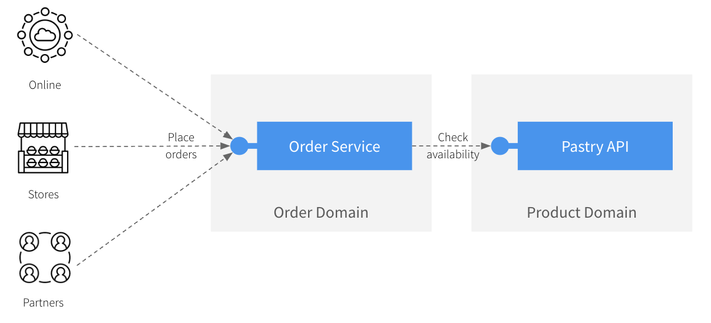

# Shift-left demo - Quarkus Order Service

This application is a sample on how to use Microcks DevServices for Quarkus within your development inner-loop.

## Application introduction

This fictional application we're working on is a typical `Order Service` that can allow online, physical stores, or even
partners to place orders for our fresh-backed pastries! For that, the `Order Service` is exposing a REST API to its consumers
but also relies on an existing API we have [introduced in a previous post](https://medium.com/@lbroudoux/different-levels-of-api-contract-testing-with-microcks-ccc0847f8c97) 😉



The `Order Service` application has been designed around 3 main components that are directly mapped on Spring Boot components and classes:
* The `OrderResource` (in package `org.acme.order.api`) is responsible for exposing an `Order API` to the outer world. This API is specified using the `src/main/resources/order-service-openapi.yaml` OpenAPI specification,
* The `OrderService` (in package `org.acme.order.service`) is responsible for implementing the business logic around the creation of orders. Typically, it checks that the products are available before recording an order. Otherwise, order cannot be placed,
* The `PastryAPIClient` (in package `org.acme.order.client`) is responsible for calling the `Pastry API` in *Product Domain* and get details or list of pastries.


Of course, this is a very naive vision of a real-life system as such an application would certainly pull out much more
dependencies (like a `Payment Service`, a `Customer Service`, a `Shipping Service`, and much more) and offer more complex API.
However, this situation is complex enough to highlight the two problems we're addressing:
1) How to **efficiently set up a development environment** that depends on third-party API like the Pastry API?
   You certainly want to avoid cloning this component repository, figuring out how to launch it and configure it accordingly. As a developer, developing your own mock of this service makes you also lose time and risk drifting from initial intent,
2) How to **efficiently validate the conformance** of the `Order API` against business expectations and OpenAPI contract?
   Besides the core business logic, you might want to validate the network and protocol serialization layers as well as the respect of HTTP semantics.

## Development phase

Let's imagine you start an interactive development/testing session, running your local server with:

```shell
$ ./mvnw compile quarkus:dev
==== OUTPUT ====
[...]
Listening for transport dt_socket at address: 5005
2023-08-09 12:25:26,496 INFO  [io.git.mic.qua.dep.DevServicesMicrocksProcessor] (build-29) The 'default' microcks container is ready on http://localhost:9191
__  ____  __  _____   ___  __ ____  ______ 
 --/ __ \/ / / / _ | / _ \/ //_/ / / / __/ 
 -/ /_/ / /_/ / __ |/ , _/ ,< / /_/ /\ \   
--\___\_\____/_/ |_/_/|_/_/|_|\____/___/   
2023-08-09 12:25:26,990 INFO  [io.quarkus] (Quarkus Main Thread) order-service 0.1.0-SNAPSHOT on JVM (powered by Quarkus 3.2.3.Final) started in 1.126s. Listening on: http://localhost:8080
2023-08-09 12:25:26,990 INFO  [io.quarkus] (Quarkus Main Thread) Profile dev activated. Live Coding activated.
2023-08-09 12:25:26,991 INFO  [io.quarkus] (Quarkus Main Thread) Installed features: [cdi, microcks, rest-client-reactive, rest-client-reactive-jackson, resteasy-reactive, resteasy-reactive-jackson, smallrye-context-propagation, vertx]
2023-08-09 12:27:02,441 INFO  [io.quarkus] (Shutdown thread) order-service stopped in 0.013s


--
Press [e] to edit command line args (currently ''), [:] for the terminal, [h] for more options>ut, [:] for the terminal, [h] for more options>
```

The beauty here is that Microcks Quarkus DevServices are included into the project's configuration (see the `pom.xml` file for details)
and thus a `default` Microcks container has been launched and is running on `http://localhost:9191`.

> **_NOTE:_**  Quarkus now ships with a Dev UI, which is available in dev mode only at http://localhost:8080/q/dev/. The Microcks Quarkus DevServices contributes
a tile in this Dev UI so that you can easily access its own UI from Quarkus.

Having a look at the `src/main/resources/application.properties` files, you'll see the `quarkus.microcks.devservices.*` properties
that allow configuring stuffs and declaring what artifacts should be load on startup. Here we've loaded the `Order API` contract as well as the `Pastry API`
dependency ones. We have also configured the `PastryAPIClient.url` to use the one provided by Microcks DevServices container.

So you should be able to directly call the Order API and invoke the whole chain made of the 3 components:

```shell
$ curl -XPOST localhost:8080/api/orders -H 'Content-type: application/json' \
    -d '{"customerId": "lbroudoux", "productQuantities": [{"productName": "Millefeuille", "quantity": 1}], "totalPrice": 10.1}'
==== OUTPUT ====    
{"id":"83661708-a75e-4fef-a354-331eef9102db","status":"CREATED","customerId":"lbroudoux","productQuantities":[{"productName":"Millefeuille","quantity":1}],"totalPrice":10.1}
``` 

## Unit Test phase

For a quick run, just launch `./mvnw test` command in a terminal to see the Microcks Quarkus DevServices in action.

As Microcks DevServices are also available during the `test` phase of the development flow, once Microcks DevServices is configured there's no other need
to bootstrap a Microcks container during your test setup.

### Mock your dependencies

These are already mocked thanks to the configuration you put into `application.properties`:

```properties
quarkus.microcks.devservices.artifacts.primaries=target/classes/order-service-openapi.yaml,target/test-classes/third-parties/apipastries-openapi.yaml
quarkus.microcks.devservices.artifacts.secondaries=target/test-classes/third-parties/apipastries-postman-collection.json
```

And thus using the mocked API is just transparent! You just have to write a regular JUnit 5 `@QuarkusTest` annotated test with
the injectoin of the `@RestClient` you actually want to test:

```java
@Inject
@RestClient
PastryAPIClient client;

@Test
public void testGetPastries() {
   // Test our API client and check that arguments and responses are correctly serialized.
   List<Pastry> pastries = client.listPastries("S");
   assertEquals(1, pastries.size());

   pastries = client.listPastries("M");
   assertEquals(2, pastries.size());

   pastries = client.listPastries("L");
   assertEquals(2, pastries.size());
}
```

### OpenAPI contract testing

Remember the 2 problems we're trying to solve here? The 2nd one is about how to validate the conformance of the `Order API` we'll
expose to consumers. We certainly can write an integration test that uses [Rest Assured](https://rest-assured.io/) or other libraries
to invoke the exposed Http layer and validate each and every response with Java assertions like:

```java
when()
   .get("/lotto/{id}", 5)
.then()
   .statusCode(200)
   .body("lotto.lottoId", equalTo(5),
      "lotto.winners.winnerId", hasItems(23, 54));
```

This certainly works but presents 2 problems in my humble opinion:
* It's a lot of code to write! And it's apply to each API interaction because for each interaction it's probably a good idea to
  check the structure of same objects in the message. This lead to a fair amount of code!
* The code you write here is actually a language specific translation of the OpenAPI specification for the `Order API`: so the same
  "rules" get duplicated. Whether you edit the code or the OpenAPI spec first, high are the chances you get some drifts between your test
  suite and the specification you will provide to consumers!

Microcks Testcontainer integration provides another approach by letting you reuse the OpenAPI specification directly in your test suite,
without having to write assertions and validation of messages for API interaction.

Your test execution will need to know the local HTTP port the Quarkus runtime is running on for test. This is done with declaration of a
`@ConfigProperty` annotated member:

```java
@ConfigProperty(name= "quarkus.http.test-port")
int quarkusHttpPort;
```

Microcks container launched by DevServices is automatically able to reach localhost on `quarkus.http.test-port` using the `host.testcontainers.internal` hostname.
In order to interact with the Microcks container, you'll need to access its URL that is available also via a `@ConfigProperty`. Optional, it can be useful
to retrieve the global Jackson ObjectMapper if you want/need to introspect the data exchanged during the conformance tests:

```java
@ConfigProperty(name= "quarkus.microcks.default.http")
String microcksContainerUrl;

@Inject
ObjectMapper mapper;
```

Finally, we can define our unit test method that allow checking that the `OrderController` (here via the `testEndpoint()` value)
is conformant with the OpenAPI specification for `Order Service`, version `0.1.0`. The nice thing is that it's just one call for validating
all the interactions with the API. That method is also super easy to enrich in the future: when the next `0.2.0` version of the API will
be under-development, you'll be able to check the conformance with both `0.1.0` and `0.2.0` as per the semantic versioning requirements.

```java
@Test
public void testOpenAPIContract() throws Exception {
  // Ask for an Open API conformance to be launched.
  TestRequest testRequest = new TestRequest.Builder()
        .serviceId("Order Service API:0.1.0")
        .runnerType(TestRunnerType.OPEN_API_SCHEMA.name())
        .testEndpoint("http://host.testcontainers.internal:" + quarkusHttpPort + "/api")
        .build();

  TestResult testResult = MicrocksContainer.testEndpoint(microcksContainerUrl, testRequest);

  // You may inspect complete response object with following:
  //System.out.println(mapper.writerWithDefaultPrettyPrinter().writeValueAsString(testResult));

  assertTrue(testResult.isSuccess());
}
```

## Related Guides

### RESTEasy Reactive

Easily start your Reactive RESTful Web Services

[Related guide section...](https://quarkus.io/guides/getting-started-reactive#reactive-jax-rs-resources)
