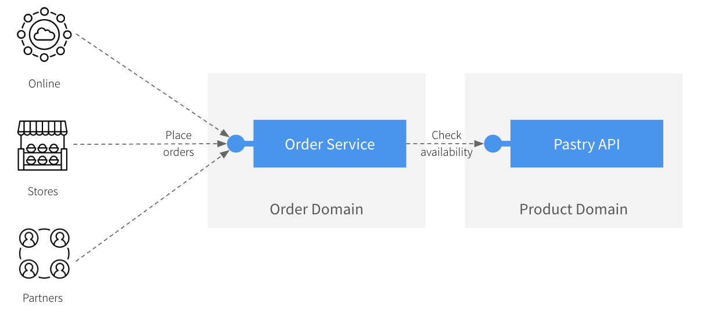

# Shift-left demo - Spring Boot Order Service

This application is a sample on how to integrate Microcks via Testcontainers within your development inner-loop.

## Application introduction

This fictional application we're working on is a typical `Order Service` that can allow online, physical stores, or even 
partners to place orders for our fresh-backed pastries! For that, the `Order Service` is exposing a REST API to its consumers
but also relies on an existing API we have [introduced in a previous post](https://medium.com/@lbroudoux/different-levels-of-api-contract-testing-with-microcks-ccc0847f8c97) 😉



The `Order Service` application has been designed around 3 main components that are directly mapped on Spring Boot components and classes:
* The `OrderController` (in package `org.acme.order.api`) is responsible for exposing an `Order API` to the outer world. This API is specified using the `src/main/resources/order-service-openapi.yaml` OpenAPI specification,
* The `OrderService` (in package `org.acme.order.service`) is responsible for implementing the business logic around the creation of orders. Typically, it checks that the products are available before recording an order. Otherwise, order cannot be placed,
* The `PastryAPIClient` (in package `org.acme.order.client`) is responsible for calling the `Pastry API` in *Product Domain* and get details or list of pastries.  


Of course, this is a very naive vision of a real-life system as such an application would certainly pull out much more
dependencies (like a `Payment Service`, a `Customer Service`, a `Shipping Service`, and much more) and offer more complex API.
However, this situation is complex enough to highlight the two problems we're addressing:
1) How to **efficiently set up a development environment** that depends on third-party API like the Pastry API? 
You certainly want to avoid cloning this component repository, figuring out how to launch it and configure it accordingly. As a developer, developing your own mock of this service makes you also lose time and risk drifting from initial intent,
2) How to **efficiently validate the conformance** of the `Order API` against business expectations and OpenAPI contract? 
Besides the core business logic, you might want to validate the network and protocol serialization layers as well as the respect of HTTP semantics.

## Development phase

Let's imagine you start an interactive development/testing session, running your local server with:

```shell
$ mvn spring-boot:run
==== OUTPUT ====
[...]
[INFO] Attaching agents: []

  .   ____          _            __ _ _
 /\\ / ___'_ __ _ _(_)_ __  __ _ \ \ \ \
( ( )\___ | '_ | '_| | '_ \/ _` | \ \ \ \
 \\/  ___)| |_)| | | | | || (_| |  ) ) ) )
  '  |____| .__|_| |_|_| |_\__, | / / / /
 =========|_|==============|___/=/_/_/_/
 :: Spring Boot ::                (v3.1.2)

2023-08-07T16:53:45.004+02:00  INFO 60867 --- [           main] org.acme.order.OrderServiceApplication   : Starting OrderServiceApplication using Java 17.0.6 with PID 60867 (/Users/laurent/Development/github/api-lifecycle/shift-left-demo/spring-boot-order-service/target/classes started by laurent in /Users/laurent/Development/github/api-lifecycle/shift-left-demo/spring-boot-order-service)
2023-08-07T16:53:45.006+02:00  INFO 60867 --- [           main] org.acme.order.OrderServiceApplication   : No active profile set, falling back to 1 default profile: "default"
2023-08-07T16:53:45.291+02:00  INFO 60867 --- [           main] o.s.b.w.embedded.tomcat.TomcatWebServer  : Tomcat initialized with port(s): 8080 (http)
2023-08-07T16:53:45.295+02:00  INFO 60867 --- [           main] o.apache.catalina.core.StandardService   : Starting service [Tomcat]
2023-08-07T16:53:45.295+02:00  INFO 60867 --- [           main] o.apache.catalina.core.StandardEngine    : Starting Servlet engine: [Apache Tomcat/10.1.11]
2023-08-07T16:53:45.326+02:00  INFO 60867 --- [           main] o.a.c.c.C.[Tomcat].[localhost].[/]       : Initializing Spring embedded WebApplicationContext
2023-08-07T16:53:45.326+02:00  INFO 60867 --- [           main] w.s.c.ServletWebServerApplicationContext : Root WebApplicationContext: initialization completed in 304 ms
2023-08-07T16:53:45.443+02:00  INFO 60867 --- [           main] o.s.b.w.embedded.tomcat.TomcatWebServer  : Tomcat started on port(s): 8080 (http) with context path ''
2023-08-07T16:53:45.447+02:00  INFO 60867 --- [           main] org.acme.order.OrderServiceApplication   : Started OrderServiceApplication in 0.556 seconds (process running for 0.683)
```

You can start Microcks as a utility tool with this simple command `microcks.sh`. Microcks docker-compose file (`microcks-docker-compose.yml`)
has been configured to automatically import the `Order API` contract but also the `Pastry API` contracts. Both APIs are discovered on startup
and Microcks UI should be available on `http://localhost:9090` in your browser:

```shell
$ ./microcks.sh
==== OUTPUT ====
[+] Running 3/2
 ✔ Network spring-boot-order-service_default       Created                                                                                                                                                                         0.0s 
 ✔ Container spring-boot-order-service-microcks-1  Created                                                                                                                                                                         0.1s 
 ✔ Container spring-boot-order-service-importer-1  Created                                                                                                                                                                         0.0s 
Attaching to spring-boot-order-service-importer-1, spring-boot-order-service-microcks-1
spring-boot-order-service-microcks-1  | exec java -javaagent:/opt/agent-bond/agent-bond.jar=jolokia{{host=0.0.0.0}},jmx_exporter{{9779:/opt/agent-bond/jmx_exporter_config.yml}} -XX:+UseParallelGC -XX:GCTimeRatio=4 -XX:AdaptiveSizePolicyWeight=90 -XX:MinHeapFreeRatio=20 -XX:MaxHeapFreeRatio=40 -XX:+ExitOnOutOfMemoryError -cp . -jar /deployments/app.jar
spring-boot-order-service-importer-1  | Got error when invoking Microcks client retrieving config: Get "http://microcks:8080/api/keycloak/config": dial tcp 172.22.0.2:8080: connect: connection refused
spring-boot-order-service-microcks-1  | I> No access restrictor found, access to any MBean is allowed
spring-boot-order-service-microcks-1  | Jolokia: Agent started with URL http://172.22.0.2:8778/jolokia/
spring-boot-order-service-importer-1 exited with code 1
spring-boot-order-service-importer-1  | Got error when invoking Microcks client retrieving config: Get "http://microcks:8080/api/keycloak/config": dial tcp 172.22.0.2:8080: connect: connection refused
spring-boot-order-service-importer-1 exited with code 1
spring-boot-order-service-microcks-1  | 
spring-boot-order-service-microcks-1  |   .   ____          _            __ _ _
spring-boot-order-service-microcks-1  |  /\\ / ___'_ __ _ _(_)_ __  __ _ \ \ \ \
spring-boot-order-service-microcks-1  | ( ( )\___ | '_ | '_| | '_ \/ _` | \ \ \ \
spring-boot-order-service-microcks-1  |  \\/  ___)| |_)| | | | | || (_| |  ) ) ) )
spring-boot-order-service-microcks-1  |   '  |____| .__|_| |_|_| |_\__, | / / / /
spring-boot-order-service-microcks-1  |  =========|_|==============|___/=/_/_/_/
spring-boot-order-service-microcks-1  | 
spring-boot-order-service-microcks-1  |  :: Spring Boot ::                (v3.1.1)
spring-boot-order-service-microcks-1  | 
spring-boot-order-service-microcks-1  | 
spring-boot-order-service-microcks-1  | 14:54:19.830  INFO 1 --- [      main] i.g.microcks.MicrocksApplication         : Starting MicrocksApplication using Java 17.0.8 with PID 1 (/deployments/app.jar started by ? in /deployments)
spring-boot-order-service-microcks-1  | 14:54:19.831 DEBUG 1 --- [      main] i.g.microcks.MicrocksApplication         : Running with Spring Boot v3.1.1, Spring v6.0.10
spring-boot-order-service-microcks-1  | 14:54:19.832  INFO 1 --- [      main] i.g.microcks.MicrocksApplication         : The following 1 profile is active: "uber"
spring-boot-order-service-importer-1  | Got error when invoking Microcks client retrieving config: Get "http://microcks:8080/api/keycloak/config": dial tcp 172.22.0.2:8080: connect: connection refused
spring-boot-order-service-importer-1 exited with code 1
spring-boot-order-service-importer-1  | Got error when invoking Microcks client retrieving config: Get "http://microcks:8080/api/keycloak/config": dial tcp 172.22.0.2:8080: connect: connection refused
spring-boot-order-service-importer-1 exited with code 1
spring-boot-order-service-microcks-1  | 14:54:20.858  INFO 1 --- [      main] i.g.microcks.config.WebConfiguration     : Starting web application configuration, using profiles: [uber]
spring-boot-order-service-microcks-1  | 14:54:20.859  INFO 1 --- [      main] i.g.microcks.config.WebConfiguration     : Web application fully configured
spring-boot-order-service-microcks-1  | 14:54:20.894  INFO 1 --- [      main] i.g.m.c.EmbeddedMongoConfiguration       : Creating a new embedded Mongo Java Server with in-memory persistence
spring-boot-order-service-microcks-1  | 14:54:20.984  INFO 1 --- [      main] de.bwaldvogel.mongo.MongoServer          : started MongoServer(port: 38853, ssl: false)
spring-boot-order-service-microcks-1  | 14:54:21.044  INFO 1 --- [      main] org.mongodb.driver.client                : MongoClient with metadata {"driver": {"name": "mongo-java-driver|sync", "version": "4.9.1"}, "os": {"type": "Linux", "name": "Linux", "architecture": "aarch64", "version": "5.15.49-linuxkit-pr"}, "platform": "Java/Red Hat, Inc./17.0.8+7-LTS"} created with settings MongoClientSettings{readPreference=primary, writeConcern=WriteConcern{w=null, wTimeout=null ms, journal=null}, retryWrites=true, retryReads=true, readConcern=ReadConcern{level=null}, credential=null, streamFactoryFactory=null, commandListeners=[], codecRegistry=ProvidersCodecRegistry{codecProviders=[ValueCodecProvider{}, BsonValueCodecProvider{}, DBRefCodecProvider{}, DBObjectCodecProvider{}, DocumentCodecProvider{}, CollectionCodecProvider{}, IterableCodecProvider{}, MapCodecProvider{}, GeoJsonCodecProvider{}, GridFSFileCodecProvider{}, Jsr310CodecProvider{}, JsonObjectCodecProvider{}, BsonCodecProvider{}, EnumCodecProvider{}, com.mongodb.client.model.mql.ExpressionCodecProvider@238bfd6c, com.mongodb.Jep395RecordCodecProvider@ef1695a]}, loggerSettings=LoggerSettings{maxDocumentLength=1000}, clusterSettings={hosts=[localhost:38853], srvServiceName=mongodb, mode=SINGLE, requiredClusterType=UNKNOWN, requiredReplicaSetName='null', serverSelector='null', clusterListeners='[]', serverSelectionTimeout='30000 ms', localThreshold='30000 ms'}, socketSettings=SocketSettings{connectTimeoutMS=10000, readTimeoutMS=0, receiveBufferSize=0, sendBufferSize=0}, heartbeatSocketSettings=SocketSettings{connectTimeoutMS=10000, readTimeoutMS=10000, receiveBufferSize=0, sendBufferSize=0}, connectionPoolSettings=ConnectionPoolSettings{maxSize=100, minSize=0, maxWaitTimeMS=120000, maxConnectionLifeTimeMS=0, maxConnectionIdleTimeMS=0, maintenanceInitialDelayMS=0, maintenanceFrequencyMS=60000, connectionPoolListeners=[], maxConnecting=2}, serverSettings=ServerSettings{heartbeatFrequencyMS=10000, minHeartbeatFrequencyMS=500, serverListeners='[]', serverMonitorListeners='[]'}, sslSettings=SslSettings{enabled=false, invalidHostNameAllowed=false, context=null}, applicationName='null', compressorList=[], uuidRepresentation=UNSPECIFIED, serverApi=null, autoEncryptionSettings=null, contextProvider=null}
spring-boot-order-service-microcks-1  | 14:54:21.052  INFO 1 --- [er-worker2] d.b.m.wire.MongoWireProtocolHandler      : client [id: 0xd0edb0db, L:/127.0.0.1:38853 - R:/127.0.0.1:47050] connected
spring-boot-order-service-microcks-1  | 14:54:21.052  INFO 1 --- [er-worker1] d.b.m.wire.MongoWireProtocolHandler      : client [id: 0x6e116023, L:/127.0.0.1:38853 - R:/127.0.0.1:47048] connected
spring-boot-order-service-microcks-1  | 14:54:21.090  INFO 1 --- [host:38853] org.mongodb.driver.cluster               : Monitor thread successfully connected to server with description ServerDescription{address=localhost:38853, type=STANDALONE, state=CONNECTED, ok=true, minWireVersion=0, maxWireVersion=6, maxDocumentSize=16777216, logicalSessionTimeoutMinutes=null, roundTripTimeNanos=47156291}
spring-boot-order-service-microcks-1  | 14:54:21.292  INFO 1 --- [      main] i.g.m.config.AICopilotConfiguration      : AICopilot is disabled
spring-boot-order-service-importer-1  | Got error when invoking Microcks client retrieving config: Get "http://microcks:8080/api/keycloak/config": dial tcp 172.22.0.2:8080: connect: connection refused
spring-boot-order-service-microcks-1  | 14:54:21.709  INFO 1 --- [      main] i.g.microcks.MicrocksApplication         : Started MicrocksApplication in 2.069 seconds (process running for 2.633)
[...]
spring-boot-order-service-importer-1  | Microcks has discovered 'Order Service:0.1.0'
[...]
spring-boot-order-service-importer-1  | Microcks has discovered 'API Pastries:0.0.1'
[...]
spring-boot-order-service-importer-1  | Microcks has discovered 'API Pastries:0.0.1'
[...]
spring-boot-order-service-importer-1 exited with code 0
```

Because our `Order Service` application has been configured to talk to Microcks mocks (see the settings in `application.properties`),
you should be able to directly call the Order API and invoke the whole chain made of the 3 components:

```shell
$ curl -XPOST localhost:8080/api/orders -H 'Content-type: application/json' \
    -d '{"customerId": "lbroudoux", "productQuantities": [{"productName": "Millefeuille", "quantity": 1}], "totalPrice": 10.1}'
==== OUTPUT ====
{"id":"58d8ff56-d484-431e-8c94-6747b7b8674b","status":"CREATED","customerId":"lbroudoux","productQuantities":[{"productName":"Millefeuille","quantity":1}],"totalPrice":10.1}  
```

## Unit Test phase

In addition, Microcks can also be launched automatically within your unit tests using [Testcontainers](https://testcontainers.com/).
Microcks provides a [`microcks-testcontainers-java`](https://github.com/microcks/microcks-testcontainers-java) module you can integrate in JUnit 4 or JUnit 5 tests.
Check the `pom.xml` of this project to see how to declare dependencies.

For a quick run, just launch `./mvnw test` command in a terminal to see the Microcks Testcontainer in action.

Below, we're using this module to test our `PastryAPIClient` to ensure all network and protocol serialization stuff are working as expected.

### Mock your dependencies

In the case you're using JUnit 5, you'll have first to declare a `MicrocksContainer` as a static `@Container` like below:

```java
@Container
public static MicrocksContainer microcksContainer = new MicrocksContainer("quay.io/microcks/microcks-uber:nightly");
```

Then, you can add a `@BeforeAll` method for importing the artifacts you'll need in your tests to mock the `Pastry API` dependency:

```java
@BeforeAll
public static void setup() throws Exception {
  microcksContainer.importAsMainArtifact(new File("target/test-classes/third-parties/apipastries-openapi.yaml"));
  microcksContainer.importAsSecondaryArtifact(new File("target/test-classes/third-parties/apipastries-postman-collection.json"));
}
```

Once the Microcks container is started, we then need to update the `pastries.baseUrl` application property that is used by the
`PastryAPIClient` component to know the endpoint of this external API. Here, we have to replace the one defined in the file by
a new URL directly provided by the Microcks container:

```java
@DynamicPropertySource
static void configureProperties(DynamicPropertyRegistry registry) {
   String url = microcksContainer.getRestMockEndpoint("API Pastries", "0.0.1");
   registry.add("pastries.baseUrl", () -> url);
}
```

Finally, we can define our unit test method that allow checking that the `PastryAPIClient` (here via the `client` reference)
is working as expected:

```java
@Test
public void testGetPastries(){
   // Test our API client and check that arguments and responses are correctly serialized.
   List<Pastry> pastries = client.listPastries("S");
   assertEquals(1,pastries.size());
}
```

In the case you're using JUnit 4, things are very similar and available in the `PastryAPIClientJUnit4Tests.java` file.

### OpenAPI contract testing

Remember the 2 problems we're trying to solve here? The 2nd one is about how to validate the conformance of the `Order API` we'll
expose to consumers. We certainly can write an integration test that uses [Rest Assured](https://rest-assured.io/) or other libraries
to invoke the exposed Http layer and validate each and every response with Java assertions like:

```java
when()
   .get("/lotto/{id}", 5)
.then()
   .statusCode(200)
   .body("lotto.lottoId", equalTo(5),
      "lotto.winners.winnerId", hasItems(23, 54));
```

This certainly works but presents 2 problems in my humble opinion:
* It's a lot of code to write! And it's apply to each API interaction because for each interaction it's probably a good idea to
check the structure of same objects in the message. This lead to a fair amount of code!
* The code you write here is actually a language specific translation of the OpenAPI specification for the `Order API`: so the same
"rules" get duplicated. Whether you edit the code or the OpenAPI spec first, high are the chances you get some drifts between your test 
suite and the specification you will provide to consumers!

Microcks Testcontainer integration provides another approach by letting you reuse the OpenAPI specification directly in your test suite,
without having to write assertions and validation of messages for API interaction.

In the case you're using JUnit 5, you'll have first to declare a `MicrocksContainer` as a static `@Container` like below.
The little difference here is that this container must have access to the host you're running your unit/integration test on: 

```java
@Container
public static MicrocksContainer microcksContainer = new MicrocksContainer("quay.io/microcks/microcks-uber:nightly")
      .withAccessToHost(true);
```

Then, you can add a `@BeforeAll` method for importing the artifacts you'll need. Here you'll need those to mock the `Pastry API` dependency
but also the `Order Service` OpenAPI specification so that Microcks know your test suite "rules":

```java
@BeforeAll
public static void setup() throws Exception {
  // Load the System Under Test OpenAPI contract into Microcks.
  microcksContainer.importAsMainArtifact(new File("target/classes/order-service-openapi.yaml"));
  // Load also the third-party ones so that RestTemplate will also use Microcks mocks 👻
  microcksContainer.importAsMainArtifact(new File("target/test-classes/third-parties/apipastries-openapi.yaml"));
  microcksContainer.importAsSecondaryArtifact(new File("target/test-classes/third-parties/apipastries-postman-collection.json"));
}
```

Your test execution will need to know the local port the Spring Boot runtime is running on. This is done with declaration of a
`@LocalServerPort` annotated member in Spring Boot:

```java
@LocalServerPort
private Integer port;
```

This port should then be used to ask `Testcontainers` to expose this port for running Microcks container. This can be done `@BeforeEach`
test. Like in mocking case, we  need to update the `pastries.baseUrl` application property with the value provided by the Microcks container
for the `Pastry API` dependency:

```java
@BeforeEach
public void setupPort() {
  // Host port exposition should be done here.
  Testcontainers.exposeHostPorts(port);
}

@DynamicPropertySource
static void configureProperties(DynamicPropertyRegistry registry) {
  String url = microcksContainer.getRestMockEndpoint("API Pastries", "0.0.1");
  registry.add("pastries.baseUrl", () -> url);
}
```

Finally, we can define our unit test method that allow checking that the `OrderController` (here via the `testEndpoint()` value)
is conformant with the OpenAPI specification for `Order Service`, version `0.1.0`. The nice thing is that it's just one call for validating
all the interactions with the API. That method is also super easy to enrich in the future: when the next `0.2.0` version of the API will
be under-development, you'll be able to check the conformance with both `0.1.0` and `0.2.0` as per the semantic versioning requirements.

```java
@Test
public void testOpenAPIContract() throws Exception {
  // Ask for an Open API conformance to be launched.
  TestRequest testRequest = new TestRequest.Builder()
        .serviceId("Order Service API:0.1.0")
        .runnerType(TestRunnerType.OPEN_API_SCHEMA.name())
        .testEndpoint("http://host.testcontainers.internal:" + port + "/api")
        .build();

  TestResult testResult = microcksContainer.testEndpoint(testRequest);
  assertTrue(testResult.isSuccess());
```

> Note we're using the special `host.testcontainers.internal` hostname that is your running host hostname that can be reached out
from the Microcks container. Remember that it's this container that is actually calling the `OrderController` API.

In the case you're using JUnit 4, things are very similar and available in the `OrderControllerContractJUnit4Tests.java` file.

For more information on the `TestResult` class and the available properties, please check the [`microcks-testcontainers-java`](https://github.com/microcks/microcks-testcontainers-java)
documentation.

### Reference Documentation

For further reference, please consider the following sections:

* [Official Apache Maven documentation](https://maven.apache.org/guides/index.html)
* [Spring Boot Maven Plugin Reference Guide](https://docs.spring.io/spring-boot/docs/3.1.2/maven-plugin/reference/html/)
* [Create an OCI image](https://docs.spring.io/spring-boot/docs/3.1.2/maven-plugin/reference/html/#build-image)

