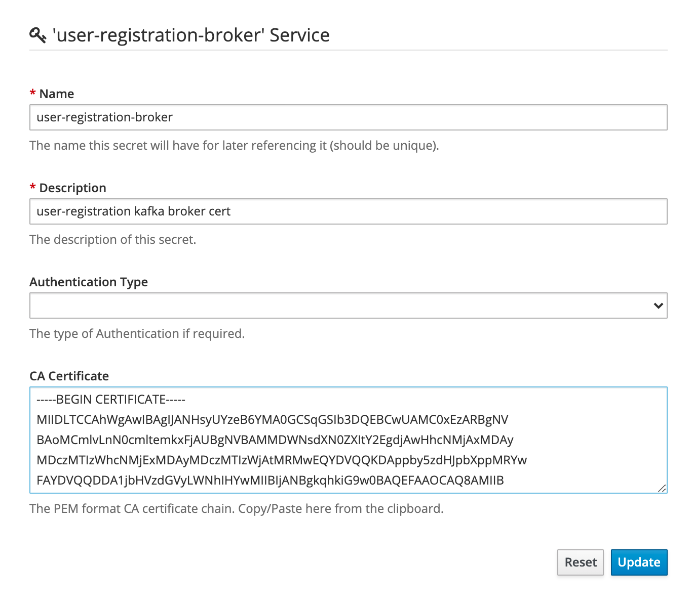
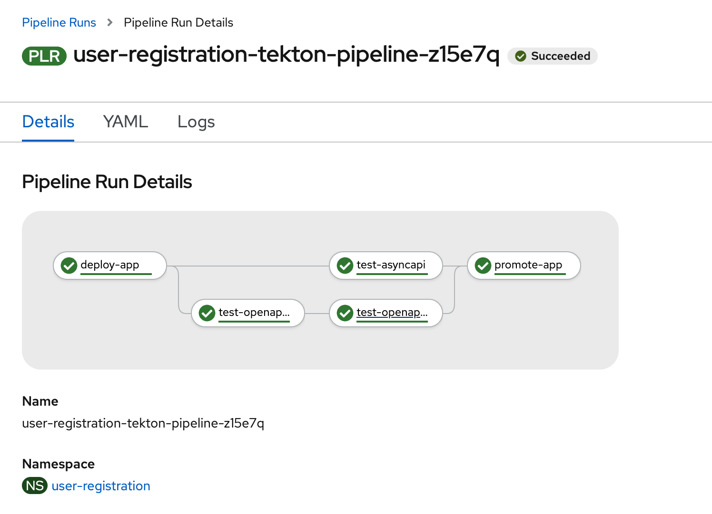

## Let's go!

```sh
kubectl create ns user-registration
```

## Preparing 

### On OpenShift

You must install the `Strimzi` or `Red Hat AMQ Streams` operator as well as the `OpenShift Pipelines Operator`.

Start creating the Kafka broker:

```sh
oc create -f kafka-broker-openshift.yml -n user-registration
```

After the broker has been provisionned, you should retrieve and extract the certificate for client connections:

```sh
oc extract secret/my-cluster-cluster-ca-cert -n user-registration --keys=ca.crt --to=- > kafka-ca-cert-user-registration.crt
```

Now install the Tekton tasks and the pipeline that is using App route and Microcks route:

```sh
oc create -f microcks-keycloak-client-secret.yml -n user-registration
oc create -f https://raw.githubusercontent.com/microcks/microcks-cli/master/tekton/echo-hello-world-task.yaml -n user-registration
oc create -f https://raw.githubusercontent.com/microcks/microcks-cli/master/tekton/microcks-test-with-secret.yaml -n user-registration
export KUBE_APPS_URL=apps.$(echo $(oc whoami --show-server) | sed -E -n 's=https://api.(.*):6443=\1=p')
rm -r user-registration-tekton-pipeline-local.yml
cp user-registration-tekton-pipeline.yml user-registration-tekton-pipeline-local.yml
sed -i '' 's=KUBE_APPS_URL='"$KUBE_APPS_URL"'=g' user-registration-tekton-pipeline-local.yml
oc create -f user-registration-tekton-pipeline-local.yml -n user-registration
```

### On Kubernetes

You must install the `Strimzi` operator as well as the `Tekton CD`.

Start creating the Kafka broker:

```sh
# Set the KUBE_APPS_URL. It could be the Ingress IP if using Minikube
export KUBE_APPS_URL=$(minikube ip).nip.io
rm -r kafka-broker-kubernetes-local.yml
cp kafka-broker-kubernetes.yml kafka-broker-kubernetes-local.yml
sed -i '' 's=KUBE_APPS_URL='"$KUBE_APPS_URL"'=g' kafka-broker-kubernetes-local.yml
kubectl create -f kafka-broker-kubernetes-local.yml -n user-registration
```

After the broker has been provisionned, you should retrieve and extract the certificate for client connections:

```sh
kubectl get secret my-cluster-cluster-ca-cert -n user-registration -o jsonpath='{.data.ca\.crt}' | base64 -D > kafka-ca-cert-user-registration.crt
```

Now install the Tekton tasks and the pipeline that is using App route and Microcks route:

```sh
kubectl create -f microcks-keycloak-client-secret.yml -n user-registration
kubectl create -f https://raw.githubusercontent.com/microcks/microcks-cli/master/tekton/echo-hello-world-task.yaml -n user-registration
kubectl create -f https://raw.githubusercontent.com/microcks/microcks-cli/master/tekton/microcks-test-with-secret.yaml -n user-registration
export KUBE_APPS_URL=apps.$(echo $(oc whoami --show-server) | sed -E -n 's=https://api.(.*):6443=\1=p')
rm -r user-registration-tekton-pipeline-local.yml
cp user-registration-tekton-pipeline.yml user-registration-tekton-pipeline-local.yml
sed -i '' 's=KUBE_APPS_URL='"$KUBE_APPS_URL"'=g' user-registration-tekton-pipeline-local.yml
kubectl create -f user-registration-tekton-pipeline-local.yml -n user-registration
```

## Configuring Microcks

You should import the 2 API contracts you'll find in the `/api-contracts folder`:
* `UserRegistrationAPI-openapi-1.0.0.yaml` represents the OpenAPI contract for the REST API that should be invoked for registrating a new User,
* `UserSignedUpAPI-asyncapi-0.1.1` represents the AsyncAPI contract for the EVENT API representing emitted event after a successfull registration. 

You should also - as an administrator of the Microcks instance - create a new Secret for the `user-registration` Kafka broker.
For that, just print out the CRT you've previously extracted:

```sh
cat kafka-ca-cert-user-registration.crt
```

and copy/paste the ouput into the `CA Certificate` form field of a new Secret that you have to call `user-registration-broker`. See screenshot below:




## Deploying the application

```sh
kubectl create -f ./api-implementations/quarkus-user-registration/deployment.yml -n user-registration
```

## Executing the pipeline

### On OpenShift from Console



### On Kubernetes or OpenShift from CLI

```sh
$ tkn pipelinerun logs user-registration-tekton-pipeline-run-64xf7 -f -n user-registration
PipelineRun started: user-registration-tekton-pipeline-run-64xf7

In order to track the PipelineRun progress run:
tkn pipelinerun logs user-registration-tekton-pipeline-run-64xf7 -f -n user-registration
```

And now checking the logs: 

```sh
$ tkn pipelinerun logs user-registration-tekton-pipeline-run-64xf7 -f -n user-registration
[deploy-app : echo] hello world

[test-openapi-v1 : microcks-test] MicrocksClient got status for test "5f76e969dcba620f6d21008d" - success: false, inProgress: true 
[test-openapi-v1 : microcks-test] MicrocksTester waiting for 2 seconds before checking again or exiting.
[test-asyncapi : microcks-test] MicrocksClient got status for test "5f76e96bdcba620f6d21008e" - success: false, inProgress: true 
[test-asyncapi : microcks-test] MicrocksTester waiting for 2 seconds before checking again or exiting.
[test-openapi-v1 : microcks-test] MicrocksClient got status for test "5f76e969dcba620f6d21008d" - success: false, inProgress: true 
[test-openapi-v1 : microcks-test] MicrocksTester waiting for 2 seconds before checking again or exiting.
[test-asyncapi : microcks-test] MicrocksClient got status for test "5f76e96bdcba620f6d21008e" - success: false, inProgress: true 
[test-asyncapi : microcks-test] MicrocksTester waiting for 2 seconds before checking again or exiting.
[test-openapi-v1 : microcks-test] MicrocksClient got status for test "5f76e969dcba620f6d21008d" - success: false, inProgress: true 
[test-openapi-v1 : microcks-test] MicrocksTester waiting for 2 seconds before checking again or exiting.
[test-asyncapi : microcks-test] MicrocksClient got status for test "5f76e96bdcba620f6d21008e" - success: false, inProgress: true 
[test-asyncapi : microcks-test] MicrocksTester waiting for 2 seconds before checking again or exiting.
[test-openapi-v1 : microcks-test] MicrocksClient got status for test "5f76e969dcba620f6d21008d" - success: true, inProgress: false 

[test-asyncapi : microcks-test] MicrocksClient got status for test "5f76e96bdcba620f6d21008e" - success: false, inProgress: true 
[test-asyncapi : microcks-test] MicrocksTester waiting for 2 seconds before checking again or exiting.
[test-asyncapi : microcks-test] MicrocksClient got status for test "5f76e96bdcba620f6d21008e" - success: false, inProgress: true 
[test-asyncapi : microcks-test] MicrocksTester waiting for 2 seconds before checking again or exiting.
[test-asyncapi : microcks-test] MicrocksClient got status for test "5f76e96bdcba620f6d21008e" - success: false, inProgress: true 
[test-asyncapi : microcks-test] MicrocksTester waiting for 2 seconds before checking again or exiting.
[test-openapi-v2 : microcks-test] MicrocksClient got status for test "5f76e975dcba620f6d210091" - success: false, inProgress: true 
[test-openapi-v2 : microcks-test] MicrocksTester waiting for 2 seconds before checking again or exiting.
[test-asyncapi : microcks-test] MicrocksClient got status for test "5f76e96bdcba620f6d21008e" - success: true, inProgress: false 
[test-openapi-v2 : microcks-test] MicrocksClient got status for test "5f76e975dcba620f6d210091" - success: true, inProgress: false 


[promote-app : echo] hello world
```

Checking latest run status:

```sh
$ tkn pipeline list -n user-registration
NAME                                AGE          LAST RUN                                      STARTED         DURATION     STATUS
user-registration-tekton-pipeline   1 hour ago   user-registration-tekton-pipeline-run-64xf7   3 minutes ago   34 seconds   Succeeded
```

### Troubleshooting

```
oc new-app obsidiandynamics/kafdrop -e "KAFKA_BROKERCONNECT=my-cluster-kafka-bootstrap:9092" -e SERVER_SERVLET_CONTEXTPATH="/" -e JVM_OPTS="-Xms32M -Xmx512M" -n user-registration
oc expose dc/kafdrop --port=9000 -n user-registration
oc expose svc kafdrop -n user-registration
```
